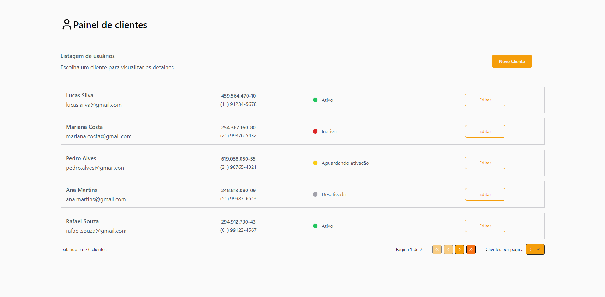
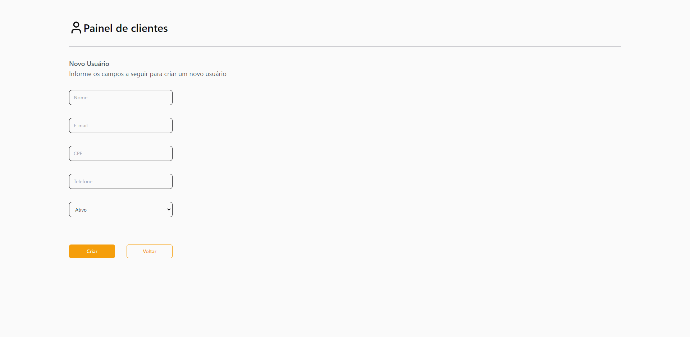

[JAVASCRIPT__BADGE]: https://img.shields.io/badge/Javascript-000?style=for-the-badge&logo=javascript
[TYPESCRIPT__BADGE]: https://img.shields.io/badge/typescript-D4FAFF?style=for-the-badge&logo=typescript
[REACT__BADGE]: https://img.shields.io/badge/React-005CFE?style=for-the-badge&logo=react
[PROJECT__BADGE]: https://img.shields.io/badge/📱Visit_this_project-000?style=for-the-badge&logo=project
[PROJECT__URL]: https://github.com/SilmarNascimento/test-UOL-fullstack/tree/Silmar_Nascimento-main
[JAVA__BADGE]: https://img.shields.io/badge/java-%23ED8B00.svg?style=for-the-badge&logo=openjdk&logoColor=white
[POSTGRES__BADGE]: https://img.shields.io/badge/postgres-%23316192.svg?style=for-the-badge&logo=postgresql&logoColor=white
[Docker__BADGE]: https://img.shields.io/badge/docker-%230db7ed.svg?style=for-the-badge&logo=docker&logoColor=white

<h1 align="center" style="font-weight: bold;">Cadastro de Clientes 💻</h1>

<h1 align="center">

  <span>![react][REACT__BADGE]</span>
  <span>![typescript][TYPESCRIPT__BADGE]</span>
  <span>![javascript][JAVASCRIPT__BADGE]</span>
  <span>![java][JAVA__BADGE]</span>
  <span>![Postgres][POSTGRES__BADGE]</span>
  <span>![Docker][Docker__BADGE]</span>
</h1>

<p align="center">
  <a href="#about">Sobre o Projeto</a> • 
  <a href="#tech">Tecnologias Utilizadas</a> •
  <a href="#started">Como Executar</a> • 
  <a href="#routes">Rotas da Aplicação</a> • 
  <a href="#author">Autor</a>
</p>

<h2 id="about">📌 Sobre o Projeto</h2>

Este projeto é uma aplicação fullstack monolítica que permite aos usuários visualizar e gerenciar clientes. O frontend oferece uma interface intuitiva e se comunica com o backend via API. O backend gerencia e armazena os dados válidos dos clientes, garantindo uma experiência completa de gerenciamento.

<h3>Layout Web</h3>
  <p align="center">
    
    
  </p>

<h3>Modelo Conceitual</h3>
  <p align="center">
    
  </p>

<h2 id="tech">🖥️ Tecnologias Utilizadas</h2>
  <h3>Front-end</h3>

  - [React](https://github.com/facebook/react)
  - [TypeScript](https://github.com/microsoft/TypeScript)

  <h3>Back-end</h3>

  - [Java](https://www.oracle.com/java/technologies/java-se-glance.html)
  - [Spring Boot](https://github.com/spring-projects/spring-boot)
  - [Hibernate](https://hibernate.org/)
  - [JUnit5](https://github.com/junit-team/junit5/)

  <h3>Banco de Dados</h3>

  - [Postgres](https://github.com/postgres/postgres)

<h2 id="started">🚀 Como Executar</h2>

<h3>Pre-requisitos</h3>

Os pré-requisitos para rodar localmente o projeto são:

- [NodeJS](https://github.com/nodejs/nodejs.org) >= 18
- [JDK 8](https://www.oracle.com/java/technologies/downloads/?er=221886)
- [Maven](https://maven.apache.org/)

O projeto também pode ser executado por containers, sendo assim os pré-requisitos são:

- [Docker](https://www.docker.com/)

<h3>Cloning</h3>

Para clonar o projeto, abra o terminal e execute o seguinte comando:

```bash
git clone git@github.com:SilmarNascimento/test-fullstack-gerenciamento-de-cliente.git
```

<h3>Executar o Projeto Localmente</h3>

Após clonar o repositório, instale as dependências do backend java executando os seguintes comandos:

```bash
# entrar na pasta do backend
cd test-fullstack-gerenciamento-de-cliente/backend

# instalar as dependências do projeto
mvn clean install
```

Como a aplicação precisa se conectar a um banco de dados, será necessário configurar as credenciais corretas no arquivo de propriedades do Spring Boot. Para isso, você precisará definir as variáveis de ambiente no arquivo application-dev.properties.

```bash
# entrar na pasta de recursos do backend
cd src/main/resources
```

No arquivo application-dev.properties, você verá as seguintes configurações de conexão com o banco de dados de modo que será necessário substituir as variáveis `${DATABASE_URL}`, `${DATABASE_USERNAME}`, e `${DATABASE_PASSWORD}` pelos valores reais:

```bash
# substituir os valores abaixo pelas variáveis
spring.datasource.url=${DATABASE_URL}
spring.datasource.driverClassName=org.postgresql.Driver
spring.datasource.username=${DATABASE_USERNAME}
spring.datasource.password=${DATABASE_PASSWORD}
```

Após substituir os valores no arquivo de propriedades, você pode subir a aplicação backend executando o seguinte comando:

```bash
# subir a aplicação backend
mvn spring-boot:run
```

Esse comando irá iniciar o servidor da aplicação backend. Por padrão, ele estará disponível em http://localhost:8080

<h3>Executar o Projeto com Docker</h3>

Caso queira executar o projeto usando docker, após clonar o projeto, abra o arquivo docker-compose.yaml na raiz do projeto e edite as variáveis de ambiente no serviço de backend para a conexão com o banco de dados. Após a configuração das variáveis de ambiente, abra o terminal e execute as instruções abaixo:

```bash
# entrar na pasta raiz do projeto e executar o comando docker
cd test-fullstack-gerenciamento-de-cliente
docker-compose up -d
```

<h2 id="routes">📍 Rotas da Aplicação</h2>

Here you can list the main routes of your API, and what are their expected request bodies.
​
| route               | description                                          
|----------------------|-----------------------------------------------------
| <kbd>/</kbd>     | página para listar todos os usuários cadastrados
| <kbd>/create/users</kbd>     | página para cadastrar um novo usuário
| <kbd>/edit/users/:userId</kbd>     | página para editar um usuário já cadastrado

<h2 id="author">📝 Autor</h2>

Silmar Fernando do Nascimento

[Linkedin](https://www.linkedin.com/in/silmarnascimento/)