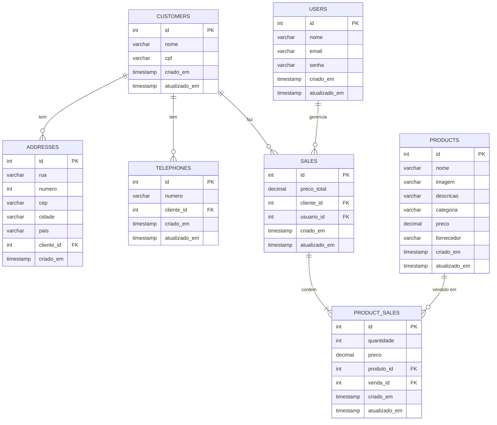

# Esquema do Banco de Dados

Este README descreve o esquema do banco de dados para nosso sistema de gerenciamento de vendas.

## Diagrama do Esquema

## Explicação do Esquema

O diagrama acima representa o esquema do nosso banco de dados para o sistema de gerenciamento de vendas. Aqui está uma explicação detalhada de cada entidade e seus relacionamentos:

1. **CUSTOMERS (Clientes)**
   - Entidade central que armazena informações dos clientes.
   - Campos: id (chave primária), nome, CPF, data de criação e atualização.
   - Relacionamentos: Um cliente pode ter vários endereços, telefones e vendas.

2. **ADDRESSES (Endereços)**
   - Armazena os endereços dos clientes.
   - Campos: id, rua, número, CEP, cidade, país, id do cliente (chave estrangeira), data de criação.
   - Relacionamento: Muitos endereços podem pertencer a um cliente.

3. **TELEPHONES (Telefones)**
   - Armazena os números de telefone dos clientes.
   - Campos: id, número, id do cliente (chave estrangeira), data de criação e atualização.
   - Relacionamento: Muitos telefones podem pertencer a um cliente.

4. **SALES (Vendas)**
   - Registra as vendas realizadas.
   - Campos: id, preço total, id do cliente (chave estrangeira), id do usuário (chave estrangeira), data de criação e atualização.
   - Relacionamentos: Uma venda está associada a um cliente e a um usuário (vendedor), e pode conter vários produtos vendidos.

5. **PRODUCT_SALES (Produtos Vendidos)**
   - Tabela de junção que relaciona produtos a vendas.
   - Campos: id, quantidade, preço, id do produto (chave estrangeira), id da venda (chave estrangeira), data de criação e atualização.
   - Relacionamentos: Conecta SALES e PRODUCTS, permitindo que uma venda tenha múltiplos produtos e um produto esteja em múltiplas vendas.

6. **PRODUCTS (Produtos)**
   - Contém informações sobre os produtos disponíveis para venda.
   - Campos: id, nome, imagem, descrição, categoria, preço, fornecedor, data de criação e atualização.
   - Relacionamento: Um produto pode estar em várias vendas através da tabela PRODUCT_SALES.

7. **USERS (Usuários)**
   - Representa os usuários do sistema (provavelmente vendedores ou administradores).
   - Campos: id, nome, email, senha, data de criação e atualização.
   - Relacionamento: Um usuário pode gerenciar várias vendas.

Este esquema permite um gerenciamento eficiente de clientes, produtos, vendas e usuários do sistema. Ele suporta operações como registro de clientes, cadastro de produtos, processamento de vendas e acompanhamento de desempenho dos vendedores.